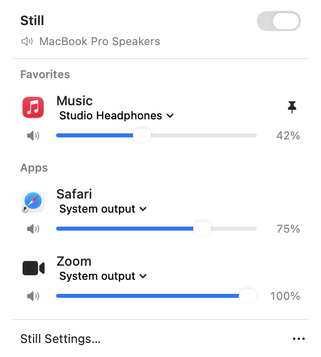
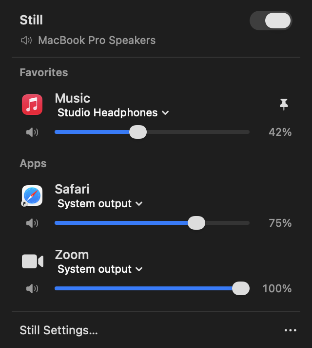
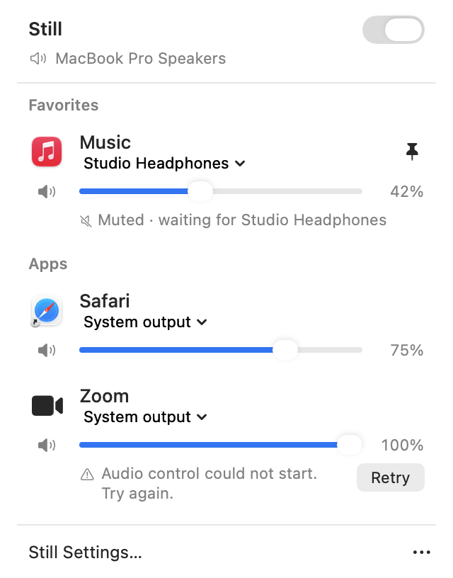

# Still

A native macOS menu bar mixer: per-app volume, mute, and output routing.

Still gives every app its own volume slider and its own output device, from a panel that
hangs off the menu bar. Play music through your headphones while a call stays on the
speakers, or turn one noisy app down without touching anything else.

<p align="center">
  
  
</p>

It is a single app with no third-party dependencies, no installed audio driver, no
privileged helper, no recording, and no network service. Audio is processed on your Mac
and is never written to disk or sent anywhere.

## Requirements

- macOS 14.2 or later
- Xcode 16 or later (Swift 6 compiler) to build it

Developed on Apple Silicon. Intel hardware has not been tested.

## Install

There is no signed release yet, so build it yourself:

```sh
git clone https://github.com/Kandel-Bibas/still.git
cd still
bash scripts/build.sh
```

That produces `dist/Still.app`. Move it somewhere permanent before you start using it —
`/Applications` is the obvious choice — then open it:

```sh
cp -R dist/Still.app /Applications/
open /Applications/Still.app
```

Use `scripts/build.sh` rather than a bare `swift build`. The script pins the linker's
SDK and deployment target, without which AppKit and SwiftUI fall back to an older
control appearance, and it adds the `Info.plist` and signature the audio permission
prompt needs.

The build is signed ad hoc for local use. It is not notarized, so macOS will warn the
first time you open it: right-click the app and choose **Open**. Rebuilding may make
macOS ask for audio permission again.

To stop that, sign with a stable self-signed certificate instead of ad hoc. Create one
once in Keychain Access → Certificate Assistant → Create a Certificate…, with Identity
Type "Self Signed Root" and Certificate Type "Code Signing", then point the build at it:

```sh
STILL_SIGN_IDENTITY="<cert name>" bash scripts/build.sh
```

A fixed certificate keeps the same designated requirement across rebuilds, so macOS
stops re-asking for System Audio Recording permission every time.

## Granting permission

The first time you route or change an app, macOS asks for **System Audio Recording**
access. Still needs it to read an app's audio, apply your volume, and play it back.

If you decline, allow Still under **System Settings → Privacy & Security → Screen &
System Audio Recording** and try again. On some macOS versions the section is called
Screen Recording. If macOS asks you to quit and reopen Still, do that before switching
the mixer on.

While Still holds a live audio tap, macOS shows a recording indicator in the menu bar.
That is the system telling you an app can hear your audio, and it appears for as long as
any app is being controlled.

## Using it

Click the sliders icon in the menu bar to open the panel, and click it again, press
Escape, or click anywhere else to close it. Right-click the icon for a short menu with
Enable Still, Settings, and Quit.

- Apps show up on their own as they start playing. Pin one to keep it in Favorites while
  it is idle.
- Each row has a 0–100% volume slider, a separate mute button, and an output picker.
- **System output** follows whatever your Mac is set to. Pick a specific device to send
  that app somewhere else.
- An app left at 100% on System output keeps its own audio path untouched, including any
  device chosen inside the app itself.
- The icon dims when the mixer is switched off.

Your settings live in `~/Library/Application Support/Still/preferences.json` and are
remembered per app.

### When a device disappears

If you send an app to a device and that device disconnects, Still keeps the app muted and
waits for it to come back rather than dumping the audio onto the speakers.

<p align="center">
  
</p>

Reconnect the device and the app resumes at its saved volume, or pick another output to
move it now.

### Switching off

Turning the mixer off, or quitting Still, hands every app back its original volume and
output. An app that Still was muting becomes audible again.

Settings has a launch-at-login option. Move the app somewhere permanent before you turn
it on, or macOS will lose track of it.

### Shortcuts and scripts

Still registers a `still://` URL scheme, so a Shortcut or a shell script can drive it
without App Intents:

- `still://volume?app=<app>&value=<0-100>`
- `still://mute?app=<app>&state=on|off|toggle`
- `still://output?app=<app>&device=<device name | system>`

`<app>` matches a running app's bundle id, or its name if no id matches. For example:

```sh
open "still://volume?app=Music&value=30"
```

Any app on the Mac can send these URLs, not just Shortcuts — a browser will ask before
opening one.

## How it works

An event-driven control queue watches Core Audio for processes and devices. When you
change an app, Still creates a private process tap for it plus a private aggregate
output device, and a small C++ callback maps the tapped stereo audio onto your chosen
output with a 5 ms gain ramp. That callback does no allocation, locking, or logging, and
it explicitly disables physical input streams so microphone audio can never reach an
output.

An app you have not changed gets no tap at all and keeps its own audio path, which is why
the mixer costs nothing until you use it.

`docs/still-report.html` is an illustrated walkthrough of the whole design — open it in a
browser.

## Limitations

- A stereo tap onto a single Float32 output stream. Encoded audio, exotic channel maps,
  and exclusive-device apps are not supported.
- A brand new process can be audible for a moment before Still discovers it and creates
  its tap.
- Browser and Electron helpers are grouped under their parent app. Per-tab routing is not
  implemented, and a helper whose owner cannot be determined appears as its own row.
- Bluetooth changes and sleep/wake can produce a brief gap.
- No boost above 100%, EQ, solo, ducking, or global hotkeys.

## Development

```sh
swift test                                   # all tests
swift test --filter PanelPlacementTests      # one suite
bash scripts/build.sh                        # build dist/Still.app
```

The UI can be inspected without a screen. This renders the real panel in every state to
PNGs:

```sh
dist/Still.app/Contents/MacOS/Still --render-previews dist/previews
```

Other diagnostics, all opt-in and local:

```sh
# Read-only inventory of audio devices and running audio apps.
dist/Still.app/Contents/MacOS/Still --diagnose

# Live discovery regression: new processes and idle/play/stop/resume in one engine.
# Plays generated quiet audio without creating taps or changing saved preferences.
dist/Still.app/Contents/MacOS/Still --discovery-probe "$PWD/dist/discovery-probe.json"

# Plays two quiet generated tones, checks independent gain/mute and route rebuilding.
# Use an absolute report path; may request audio permission.
open -n dist/Still.app --args --audio-probe "$PWD/dist/audio-probe.json"
```

Routing rules, panel placement, and the DSP are unit tested. Anything touching real
devices needs the manual checks in [docs/verification.md](docs/verification.md);
`AGENTS.md` has the repo's landmines.
